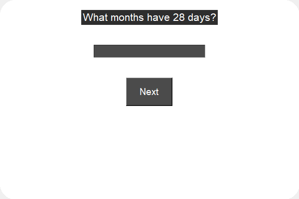

# IQ Calculator Application

This is a simple IQ calculator application built using Python and Tkinter. It presents a series of questions to the user and calculates their IQ based on the number of correct answers.

## Features

- Creative theme GUI with curved borders
- A series of interesting brain teasers and IQ-related questions
- Calculates and displays the user's IQ score

## Questions

The application includes the following questions:

1. What months have 28 days?
2. You need to enter a dark room and only have one match. What do you light first?
3. A bat and a ball cost a total of $1.10. The bat costs $1.00 more than the ball. How much does the ball cost?
4. A patch of lily pads covers an area within a lake, and the patch doubles its size every day. If it takes 48 days for the patch to cover the entire lake, how long would it take for the patch to cover half of the lake?
5. A red house is made of red bricks, and a blue house is made of blue bricks. What's a greenhouse made of?
6. Assume you're driving the bus from New York to Boston. Fifteen people get on the bus in New York, and only one person gets off the bus when you reach your destination in Boston. What's the name of the bus driver?
7. A house has only four walls and each of them face south. Each wall has its own window, and suddenly a bear enters the house through a window. What color is the bear?
8. How much is half of 2 + 2?
9. You're in a house that has two rooms, and there's no way to see from one room to the other. One room has three light switches, and the other room has three corresponding light bulbs. You don't know which switch triggers which bulb and can only make a single trip between the two rooms. How do you find out?

## How to Run

1. Make sure you have Python installed on your system. You can download Python from [python.org](https://www.python.org/).
2. Clone the repository or download the source code.
3. Navigate to the directory containing the source code.
4. Run the application using the following command:

   ```sh
   python iq_calculator.ipynb
   ```

## Author

- **Muhammad Yousaf**
- **Email**: yousafsahiwal3@gmail.com

## License

This project is licensed under the MIT License - see the [LICENSE](LICENSE) file for details.

## Screenshot


